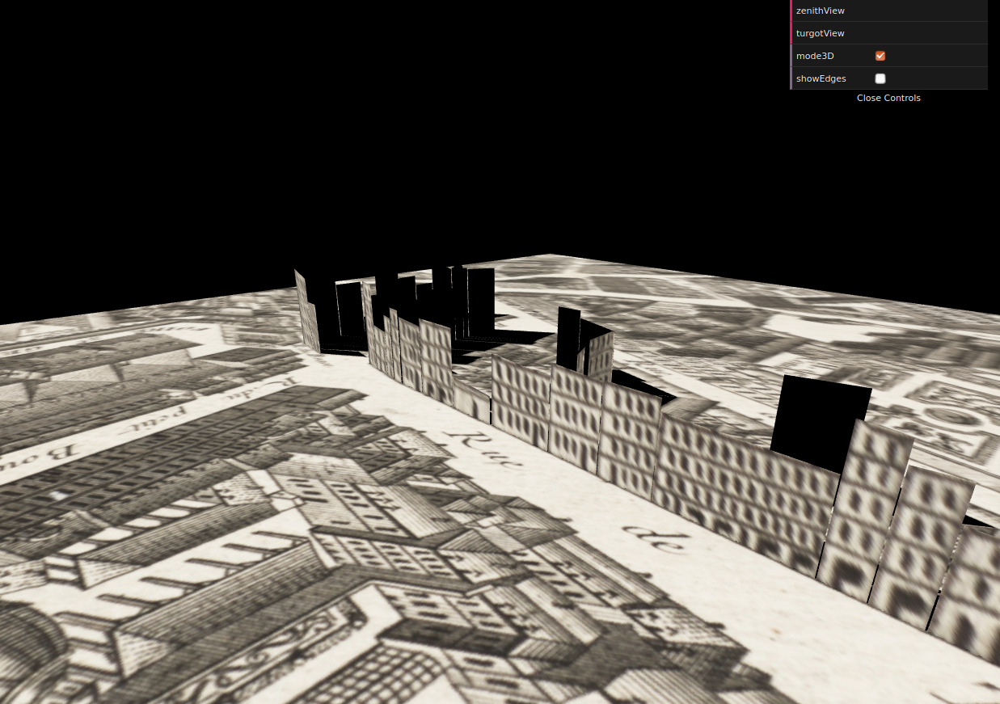
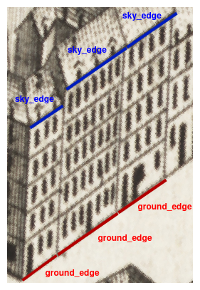

# BET3D
## Building Elevation for Turgot map in 3D

## Context
This project takes place in the Web 3D lesson of the TSI course at the [ENSG](http://www.ensg.eu). The [IGN](http://www.ign.fr) wants to create a 3D view from the [Turgot map](https://fr.wikipedia.org/wiki/Plan_de_Turgot#/media/Fichier:Turgot_map_of_Paris_-_Norman_B._Leventhal_Map_Center.jpg) of Paris.

The objectives are:
* Lifting the buildings facades up from the Paris Turgot map
* Holing the map where the buildings were drawn
* Viewing the map from the original Turgot perspective
* Viewing the map from the zenithal perspective
* Switching between 2D and 3D views

## Development

### Hypothesis and decisions

To complete the objectives, we had to make some decision:
* Only the facades are lifted up, not the roofs
* The buildings height in 2D is computed from the distance between the bottom of the building and the top of its facade in the map image.
* The map was not really holed when the building are lifted up. Indeed, a set of black polygons are drawn over the map in order to hide the facades.

### Process

The steps of the project were:
1. Georeferencing the map with QGIS:
    * The files [turgot_map_crop2.jpeg](./images/turgot_map_crop2.jpeg) and [turgot_map_crop2.tif](./images/turgot_map_crop2.tif) refer to a georeferenced crop of the original map
1. Creating a sample of edges with QGIS:
    * There are two types of edges: `ground_edges` and `sky_edges` (cf schema)
    * The json files of those geometries are in the folder [edges](./edges)
2. Implementing the application:
    1. Loading the GeoJSON
    2. Creating a geometry for the map in 2D
    3. Creating a geometry for the buildings in 3D
    4. Implementing functionnalities:
        * a button `zenithView` to switch to the Turgot view
        * a button `turgotView` to switch to the zenithal view
        * a radio button `mode3D` to display the 3D buildings or not

The protocols of this process are explained in the [protocols.md](./protocols.md) file.

## Authors
* Marie Stretti: 
   * GitHub: @MarieStretti
   * GitLab: @MarieStr
* Fanny Vignolles:
   * GitHub: @fvgls
   * GitLab: @fvgls
