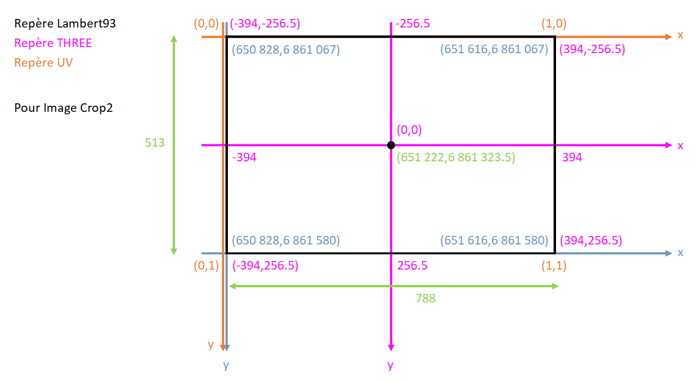

# Protocoles

## Mettre la carte en texture
1. Géoréférencement de la carte Turgot : (QGIS)
    1. Saisir les points de contrôle entre la carte et un fond OSM : SRC Lambert93 (ESPG:2154)
    1. Appliquer le géoréférencement avec :
        * traitement projective
        * compression LTZ
        * application de la transparence
    1. Enregistrer en `geoTIF`
1. Convertir en `jpeg` : `convert myfile.tif myfile.jpeg`
1. Appliquer le `jpeg` en texture d'un _BufferGeometry_ de THREE.js (création du bufferGeometry comme dans OpenGL avec les uv dans un tableau séparé => cf [schémas](./images/translation.png)) qui représente le support de notre carte.

## Coordonnées et uv
Les coordonnées ont besoin d'avoir un traitement afin de ramener le centre de l'image au centre du repère THREE.js (0, 0, 0).

1. Calcul de la matrice de translation afin de pouvoir ramener toutes nos coordonnées Lambert93 en coordonnées THREE avec le centre à (0,0,0) dans THREE
    1. Prendre la bounding box
    2. Calculer le centre de l'image
        ```
        X_centreLambert = X_minLambert + (X_maxLambert - X_minLambert) / 2
        Y_centreLambert = Y_minLambert + (Y_maxLambert - Y_minLambert) / 2
        ```
    3. **Matrice de translation :** 
        ```
        (X_three, Y_three) = (X_lambert - X_centre, Y_lambert - Y_centre)
        ```
1. Calcul de la boundingBox du _BufferGeometry_ pour avoir la correspondance avec la boundingBox de l'image en Lambert93 (cf variable `HALF_WIDTH` and `HALF_HEIGHT` dans `script.js`)
    ```
    HALF_WIDTH = (X_maxLambert - X_minLambert) / 2
    HALF_HEIGHT = (Y_maxLambert - Y_minLambert) / 2
    ```
1. Calcul des uv pour que la texture s'applique comme il faut sur les triangles qui seront créés par les `vertices` :
    * Formule théorique
    ```
    u = (x - x_min) / (x_max - x_min)
    v = (y - y_min) / (y_max - y_min)
    ```
    * Application : (dans le cas où on translate avant)
    ```
    U = ( X_three - (-HALF_WIDTH) ) / ( HALF_WIDTH - (-HALF_WIDTH) ) 
      = ( X_three + HALF_WIDTH ) / ( 2 * HALF_WIDTH )

    V = ( Y_three - (-HALF_HEIGHT) ) / ( HALF_HEIGHT - (-HALF_HEIGHT) ) 
      = ( Y_three + HALF_HEIGHT ) / ( 2 * HALF_HEIGHT )
    ```


## Echantillons
2. Créer un échantillon de bâtiment : (QGIS)
    1. Saisir dans un shapefile (`ground.shp`), les arêtes au sol des bâtiments (de gauche à droite dans le sens de la carte de Turgot)
    1. Saisir dans un autre shapefile (`sky.shp`), les arêtes du haut des bâtiments (de gauche à droite dans le sens de la carte de Turgot).
    * **Note :** une arête _ground_ et une arête _sky_ correspondant au même bâtiment, doivent avoir le **même identifiant** dans leur shapefile respectif.
3. Convertir les échantillons shapefile de bâtiments en deux `geoJSON` (avec QGIS => Save AS).
1. Dans THREE.js, parser les deux `geoJSON` (`JSON.parse`) et les mettre dans des objets JS.
2. Calculer les coordonnées projetées des échantillons : (ie ramener les _sky_ au-dessus des _ground_)
    1. Calculer la distance entre les _ground_ et les _sky_ pour avoir le z (altitude) à appliquer sur les _sky_. 
    1. Les (x,y) des _ground_ seront les coordonnées (x,y) pour les _ground_ et les _sky_. 
    * **Conclusion :**
        ```
        D = sqrt[ ( X_ground_2D - X_sky_2D )^2 + ( Y_ground_2D - Y_sky_2D )^2 ]

        ( X_ground_3D, Y_ground_3D, Z_ground_3D ) = ( X_ground_2D, Y_ground_2D, 0.0 )

        ( X_sky_3D, Y_sky_3D, Z_sky_3D ) = ( X_ground_2D, Y_ground_2D, D )
        ```




## Bibliographie

### Tutoriel QGIS géoréférencement
https://docs.qgis.org/2.8/fr/docs/user_manual/plugins/plugins_georeferencer.html


### OpenData Bati
1. OpenData APUR : http://opendata.apur.org/search 
1. Bati Paris + année ou période construction : http://opendata.apur.org/datasets/emprise-batie-paris?geometry=2.334%2C48.857%2C2.360%2C48.861
2. Bati Paris hauteur : http://opendata.apur.org/datasets/hauteur-bati-2012?geometry=2.236%2C48.828%2C2.446%2C48.867
1. Voie Paris : http://opendata.apur.org/datasets/voie?geometry=2.327%2C48.856%2C2.379%2C48.866 
